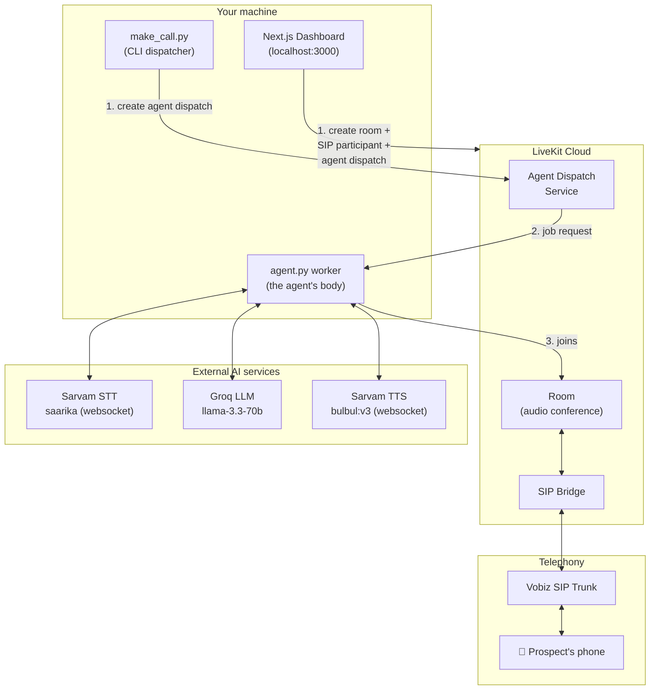
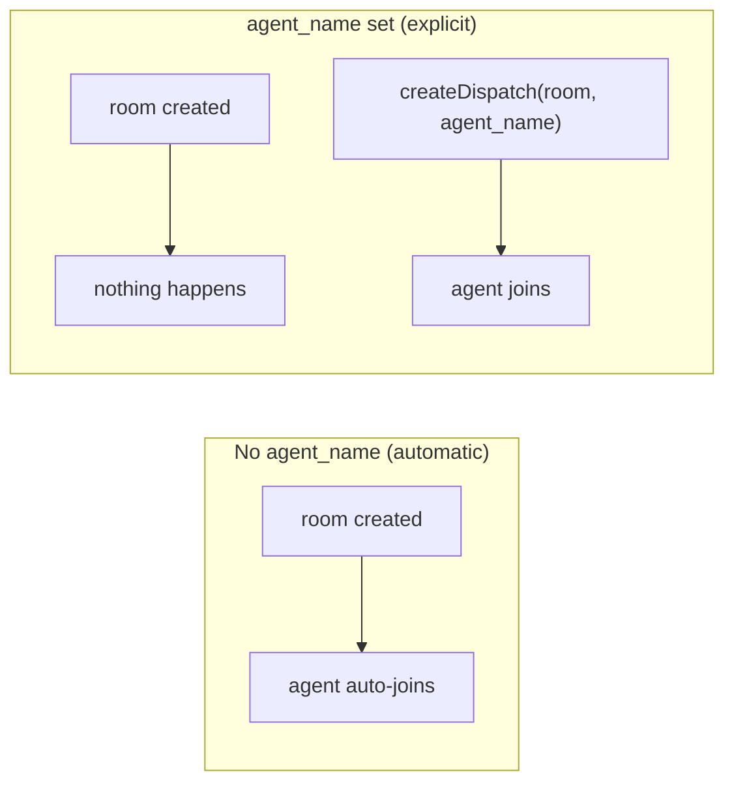
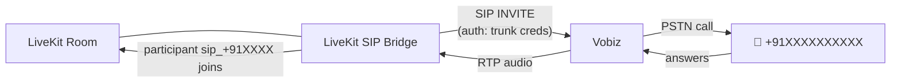
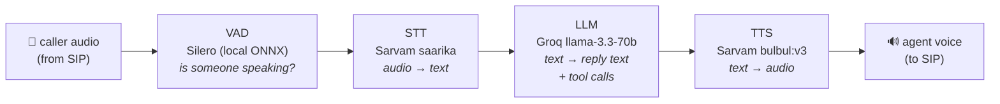
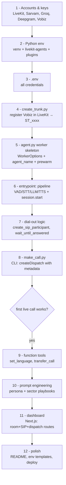
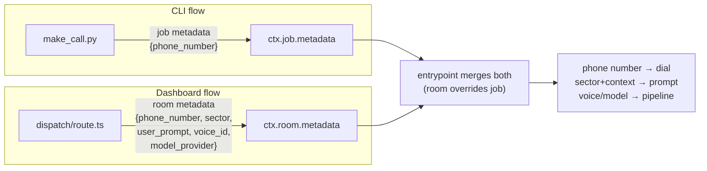
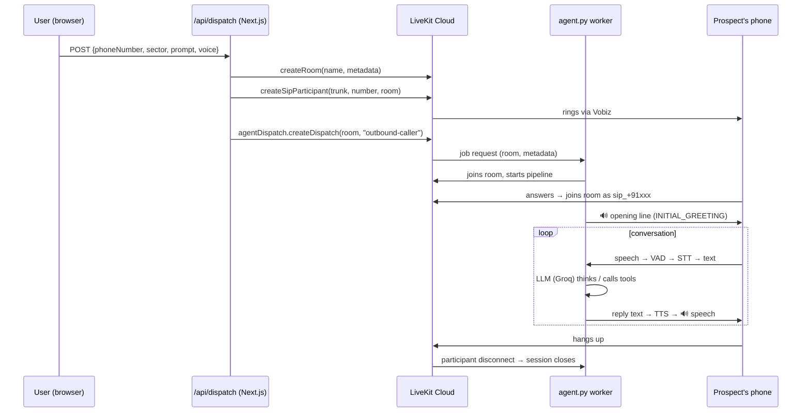
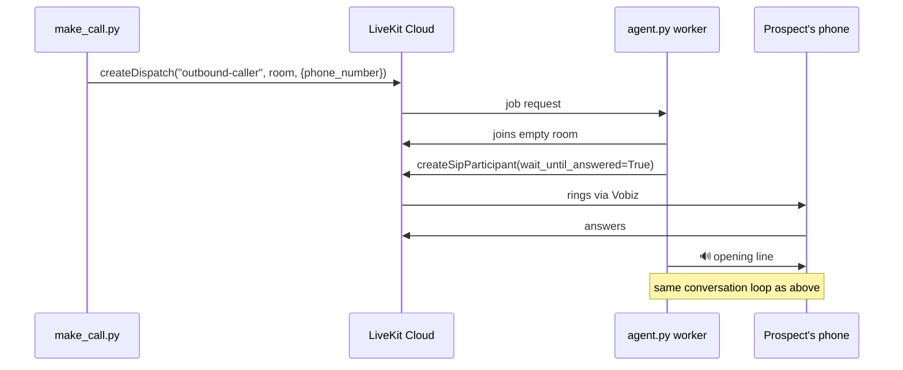
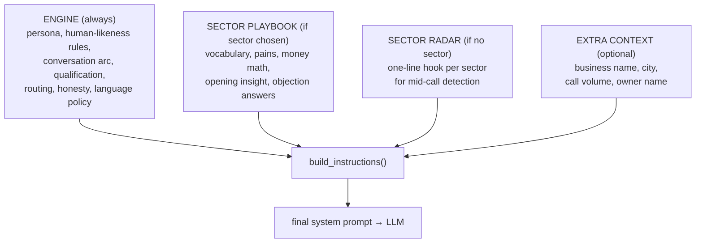

# 📚 KNOWLEDGE — Building an Outbound AI Voice Sales Agent from Scratch

This document explains **everything** that goes into this project: the concepts, the architecture, every core piece of code, why it's written the way it is, and the hard-won lessons from debugging it to a working state. Read this and you can rebuild the entire system from zero.

---

## Table of Contents

1. [What we are building](#1-what-we-are-building)
2. [The big picture — system architecture](#2-the-big-picture--system-architecture)
3. [Core concept #1 — LiveKit rooms and agents](#3-core-concept-1--livekit-rooms-and-agents)
4. [Core concept #2 — SIP trunking (how software reaches a real phone)](#4-core-concept-2--sip-trunking)
5. [Core concept #3 — the voice pipeline (VAD → STT → LLM → TTS)](#5-core-concept-3--the-voice-pipeline)
6. [Building it step by step](#6-building-it-step-by-step)
7. [The complete call flow (sequence diagrams)](#7-the-complete-call-flow)
8. [Function tools — giving the LLM abilities](#8-function-tools--giving-the-llm-abilities)
9. [Prompt engineering — the consultant brain](#9-prompt-engineering--the-consultant-brain)
10. [The web dashboard](#10-the-web-dashboard)
11. [Hard-won lessons (the bugs that cost us hours)](#11-hard-won-lessons)
12. [Glossary](#12-glossary)

---

## 1. What we are building

An **outbound AI voice agent**: software that places a real phone call to a real phone number, speaks with a natural voice, listens, understands, and holds a goal-driven conversation (here: a sales consultant that diagnoses a business's operational pain and books a demo) — in English, Hindi, or Kannada, switching live mid-call.

Five external services combine to make this possible:

| Service | Role | Analogy |
|---|---|---|
| **LiveKit Cloud** | Real-time audio infrastructure: rooms, WebRTC, SIP bridge, agent dispatch | The telephone exchange + conference room |
| **Vobiz** | SIP provider: connects internet audio to the public phone network (PSTN) | The phone line |
| **Sarvam AI** | Speech-to-Text + Text-to-Speech for Indian languages | The ears and the mouth |
| **Groq** | Ultra-low-latency LLM inference (Llama 3.3 70B) | The brain |
| **Silero VAD** | Voice Activity Detection (runs locally, ONNX model) | The reflex that knows when someone is talking |

---

## 2. The big picture — system architecture



**The key mental model:** a phone call is just *another participant in an audio room*. The agent joins a LiveKit room; the SIP bridge "invites" the phone number into the same room; from then on, the agent and the human are simply two participants exchanging audio streams.

---

## 3. Core concept #1 — LiveKit rooms and agents

### Rooms
A **room** is a named real-time audio/video session in LiveKit Cloud. Participants join it and exchange media. Rooms can carry **metadata** — an arbitrary JSON string we use to pass the phone number, target sector, and per-call context to the agent.

### The worker model
`agent.py` is not a script that runs one call. It is a **worker**: a long-lived process that

1. registers itself with LiveKit Cloud under a name (`outbound-caller`),
2. waits for **job requests**,
3. for each job, spawns a job process that joins the room and runs the conversation.

```python
# agent.py — the worker entrypoint
agents.cli.run_app(
    agents.WorkerOptions(
        entrypoint_fnc=entrypoint,     # runs once per call/job
        prewarm_fnc=prewarm,           # runs once per process (load heavy models here)
        agent_name="outbound-caller",  # ← THIS puts the worker in EXPLICIT DISPATCH mode
    )
)
```

### ⚠️ Explicit dispatch — the most important subtlety in the whole project

Setting `agent_name` changes the worker's behavior fundamentally:

- **Without** `agent_name`: the worker auto-joins *every* new room in the project.
- **With** `agent_name`: the worker joins a room **only** when someone explicitly calls the *Agent Dispatch API* for that room.



If you create the SIP call but forget the dispatch, **the phone rings, the human answers, and hears silence** — they're alone in the room. This exact bug cost us a debugging session (see [§11](#11-hard-won-lessons)).

### Prewarm — load heavy things once

The Silero VAD is an ONNX model that takes seconds to load. Loading it inside `entrypoint` would delay *every call* (and once stalled the event loop for 13s under memory pressure). The fix: load it once per job process and stash it in `userdata`:

```python
def prewarm(proc: agents.JobProcess):
    proc.userdata["vad"] = silero.VAD.load()

# then in entrypoint:
session = AgentSession(vad=ctx.proc.userdata["vad"], ...)
```

---

## 4. Core concept #2 — SIP trunking

**SIP** (Session Initiation Protocol) is how internet systems talk to the phone network. A **trunk** is a configured connection to a SIP provider (Vobiz) with credentials and a caller-ID number.

### One-time setup: register the trunk inside LiveKit

```python
# create_trunk.py (core of it)
trunk_info = SIPOutboundTrunkInfo(
    name="Vobiz Trunk",
    address=sip_address,          # e.g. 19bde626.sip.vobiz.ai
    auth_username=username,
    auth_password=password,
    numbers=[number],             # the caller ID shown to the callee
)
trunk = await lkapi.sip.create_outbound_trunk(
    CreateSIPOutboundTrunkRequest(trunk=trunk_info)
)
print(trunk.sip_trunk_id)         # → ST_xxxx — goes into .env
```

### Per-call: dial a number into a room

Two ways to do it. The **agent dials** (CLI flow) or the **backend dials** (dashboard flow):

```python
# agent-side dial-out (agent.py) — used when make_call.py dispatched us
await ctx.api.sip.create_sip_participant(
    api.CreateSIPParticipantRequest(
        room_name=ctx.room.name,
        sip_trunk_id=config.SIP_TRUNK_ID,
        sip_call_to=phone_number,
        participant_identity=f"sip_{phone_number}",
        wait_until_answered=True,   # block until human picks up (or ~30s 408 timeout)
    )
)
```

When the human answers, they appear in the room as participant `sip_+91xxxxxxxxxx`, and audio flows both ways.



---

## 5. Core concept #3 — the voice pipeline

Every conversational turn flows through four stages, orchestrated by LiveKit's `AgentSession`:



- **VAD** decides when the user started/stopped talking → enables interruption ("barge-in": if the human talks over the agent, the agent stops).
- **STT** streams audio to Sarvam over a websocket, gets back live transcripts. We set `language="unknown"` so it auto-detects English/Hindi/Kannada until the caller picks one.
- **LLM** receives the running chat history + the system prompt, produces the reply and/or **tool calls**.
- **TTS** streams the reply text to Sarvam and gets back audio, which is published into the room.

Assembling it in code — this is the heart of `entrypoint()`:

```python
session = AgentSession(
    vad=ctx.proc.userdata["vad"],
    stt=_build_stt(...),   # sarvam.STT(model="saarika:v2.5", language="unknown")
    llm=_build_llm(...),   # openai.LLM(base_url="https://api.groq.com/openai/v1", ...)
    tts=_build_tts(...),   # sarvam.TTS(model="bulbul:v3", speaker="pooja", target_language_code="en-IN")
)

await session.start(
    room=ctx.room,
    agent=OutboundAssistant(tools=[...], instructions=composed_prompt),
    room_input_options=RoomInputOptions(
        noise_cancellation=noise_cancellation.BVCTelephony(),  # telephony-tuned NC
        close_on_disconnect=True,                              # end when caller hangs up
    ),
)
```

> **Note:** Groq exposes an OpenAI-compatible API, so there is no separate "groq plugin" — we use the `openai` plugin pointed at Groq's `base_url`. This trick works for any OpenAI-compatible provider.

**Provider-builder pattern.** Each stage has a `_build_xxx()` factory that picks the provider from (per-call metadata → env var → config default). This one pattern gives you per-call model switching from the dashboard with zero extra architecture:

```python
def _build_tts(config_provider=None, config_voice=None):
    provider = (config_provider or os.getenv("TTS_PROVIDER", config.DEFAULT_TTS_PROVIDER)).lower()
    if provider == "sarvam":
        return sarvam.TTS(model=..., speaker=..., target_language_code=...)
    if provider == "deepgram":
        return deepgram.TTS(model=...)
    return openai.TTS(...)
```

---

## 6. Building it step by step

The order to build this from an empty folder:



### Dependencies (`requirements.txt`)

```
livekit-agents            # the framework: worker, AgentSession, pipeline
livekit-api               # server API client: rooms, SIP, dispatch
livekit-plugins-openai    # LLM adapter (works for Groq via base_url)
livekit-plugins-deepgram  # optional English STT/TTS
livekit-plugins-sarvam    # Indian-language STT/TTS
livekit-plugins-silero    # local VAD
livekit-plugins-noise-cancellation
python-dotenv             # .env loading
certifi                   # SSL certificates
```

### The minimal CLI dispatcher (`make_call.py` core)

```python
lk_api = api.LiveKitAPI(url=url, api_key=key, api_secret=secret)
room_name = f"call-{phone_number.replace('+','')}-{random.randint(1000,9999)}"

await lk_api.agent_dispatch.create_dispatch(
    api.CreateAgentDispatchRequest(
        agent_name="outbound-caller",              # must match agent.py
        room=room_name,
        metadata=json.dumps({"phone_number": phone_number}),
    )
)
```

That's the whole trigger. The worker receives the job, reads `phone_number` from job metadata, joins the room, and dials out itself.

### Metadata — how context travels

There are **two metadata channels** and the agent reads both:



### Dial-or-not decision

The same agent serves both flows, so `entrypoint` checks whether the human is *already* in the room (dashboard dialed them) or must be dialed (CLI flow):

```python
user_already_here = any("sip_" in p.identity for p in ctx.room.remote_participants.values())
if phone_number and not user_already_here:
    ...create_sip_participant(...)        # agent dials
await session.generate_reply(instructions=config.INITIAL_GREETING)  # agent speaks first
```

---

## 7. The complete call flow

### Dashboard flow (backend dials, then dispatches the agent)



### CLI flow (agent dials)



---

## 8. Function tools — giving the LLM abilities

A **function tool** is a Python method exposed to the LLM. The LLM decides *when* to call it based on its description; the framework executes it and feeds the result back. Tools live in a `ToolContext`:

```python
class TransferFunctions(llm.ToolContext):
    def __init__(self, ctx, phone_number=None):
        super().__init__(tools=[])
        self.ctx = ctx
        self.agent = None   # set later; needed for live TTS swapping

    @llm.function_tool(description="Call this exactly once, right after the caller "
                                   "states which language they want to continue in.")
    async def set_language(self, language: str):
        codes = {"english": "en-IN", "hindi": "hi-IN", "kannada": "kn-IN"}
        lang_code = codes.get(language.strip().lower())
        new_tts = sarvam.TTS(model="bulbul:v3", speaker="pooja",
                             target_language_code=lang_code)
        self.agent.update_options(tts=new_tts)   # 🔥 hot-swap TTS mid-call, no restart
        return f"Language switched to {language}."
```

**The hot-swap trick:** `Agent.update_options(tts=...)` replaces a pipeline component *on the live session*. That's how one call can start in English and continue in Kannada — the LLM calls `set_language`, we build a new Sarvam TTS with a different `target_language_code`, and the very next agent reply speaks the new language.

The second tool, `transfer_call`, uses LiveKit's SIP transfer API to hand the human to a real phone number:

```python
await self.ctx.api.sip.transfer_sip_participant(
    api.TransferSIPParticipantRequest(
        room_name=self.ctx.room.name,
        participant_identity=f"sip_{self.phone_number}",
        transfer_to=f"sip:{number}@{SIP_DOMAIN}",
    )
)
```

Wiring tools into the agent:

```python
fnc_ctx = TransferFunctions(ctx, phone_number)
agent = OutboundAssistant(tools=list(fnc_ctx.function_tools.values()), instructions=...)
fnc_ctx.agent = agent   # give the tool context a back-reference for hot-swapping
```

---

## 9. Prompt engineering — the consultant brain

The prompt is **composed in layers** per call, not hardcoded:



```python
def build_instructions(sector=None, extra_context=None):
    parts = [SYSTEM_PROMPT]                                   # the engine
    if sector in SECTOR_PLAYBOOKS:
        parts.append("# YOUR TARGET FOR THIS CALL\n" + SECTOR_PLAYBOOKS[sector])
    else:
        parts.append("# SECTOR RADAR\n" + _SECTOR_INDEX)
    if extra_context:
        parts.append("# EXTRA CONTEXT FOR THIS CALL\n" + extra_context)
    return "\n\n".join(parts)
```

Design principles that made the voice conversation *feel* human:

- **Diagnose, don't sell** — the prompt forbids pitching; it instructs one question per turn, building on the prospect's last answer, computing ROI with *their* numbers.
- **Speech-mechanics rules in the prompt** — varied sentence length, rare disfluencies, no bullet-speak, no corporate adjectives, react emotionally before factually.
- **Phonetic spelling for TTS** — the TTS engine mispronounced "DStarix", so the prompt spells it "Dee-Starix" everywhere. *If the voice says a name wrong, fix the text, not the engine.*
- **Tool discipline** — each tool description states exactly *when* to call it ("exactly once, right after the caller states which language...") because the LLM follows tool descriptions more reliably than general instructions.
- **Greeting as instruction, not script** — `INITIAL_GREETING` is an instruction ("introduce yourself, one line on why, ask if it's a bad time") passed to `session.generate_reply(...)`, so the model phrases it naturally each call.

---

## 10. The web dashboard

A Next.js app with two API routes and a form. The critical route does **three** LiveKit operations in order:

```ts
// dashboard/app/api/dispatch/route.ts (core)
const metadata = JSON.stringify({ phone_number, user_prompt, model_provider, voice_id, sector });

// 1. Room first, WITH metadata (createSipParticipant has no roomMetadata option!)
await roomService.createRoom({ name: roomName, metadata, emptyTimeout: 300 });

// 2. Dial the human into the room via the trunk
await sipClient.createSipParticipant(trunkId, phoneNumber, roomName, {
    participantIdentity: `sip_${phoneNumber}`,
});

// 3. THE step everyone forgets: explicitly dispatch the agent
await agentDispatchClient.createDispatch(roomName, "outbound-caller", { metadata });
```

Clients (all from `livekit-server-sdk`):

```ts
export const roomService         = new RoomServiceClient(URL, KEY, SECRET);
export const sipClient           = new SipClient(URL, KEY, SECRET);
export const agentDispatchClient = new AgentDispatchClient(URL, KEY, SECRET);
```

The form (`CallDispatcher.tsx`) collects: phone number, **target sector** (dropdown feeding the playbook injection), free-text context, model provider, and voice — and POSTs them to the route above. `queue/route.ts` is the same logic in a loop for bulk dialing.

---

## 11. Hard-won lessons

Every one of these cost real debugging time. Learn them for free:

| # | Symptom | Root cause | Fix |
|---|---|---|---|
| 1 | **Call answers → total silence** | Dashboard created the SIP call but never dispatched the agent; with `agent_name` set, workers **never** auto-join | Always call `agentDispatchClient.createDispatch(room, agentName)` after dialing |
| 2 | **Metadata never reached the agent** | Passed `roomMetadata` to `createSipParticipant` — that option **does not exist**; TypeScript caught it, JavaScript would have silently dropped it | Create the room explicitly first with `createRoom({ metadata })` |
| 3 | **13-second stall, then WebRTC/STT timeouts** | `silero.VAD.load()` inside the per-call entrypoint, on a RAM-starved machine | Load once in `prewarm_fnc`, share via `proc.userdata` |
| 4 | **Random websocket timeouts to Deepgram/LiveKit with a healthy network** | Machine at <200 MB free RAM → OS swapping → event loop stalls past handshake timeouts | Real-time voice needs real memory headroom (~1 GB); close Chrome |
| 5 | **`UnicodeEncodeError` after a successful dispatch** | Windows console is cp1252; scripts printed ✅ emoji | `sys.stdout.reconfigure(encoding="utf-8")` at script start |
| 6 | **`sip request timed out (408)`** | Nobody answered within `ringing_timeout` (~30 s default) | Not a bug; tune `ringing_timeout` on `CreateSIPParticipantRequest` if needed |
| 7 | **Voice speaks the "wrong" language** | TTS language ≠ text language: Kannada TTS reading English text still sounds English | The **LLM's output text** must be in the target language (prompt), *and* the TTS `target_language_code` must match (tool hot-swap) — both, always |
| 8 | **Company name mispronounced** | TTS reads spelling, not intent | Spell phonetically in all prompt text ("Dee-Starix") |
| 9 | **Old `anushka` voice broke after model upgrade** | Sarvam voices are **model-bound**: `anushka` is bulbul:v2-only, `pooja`/`rahul` are v3 | Check the plugin's `MODEL_SPEAKER_COMPATIBILITY` map when changing either |
| 10 | **Worker "at full capacity" logs** | Load estimation on a busy machine, not an error | Informational; worker recovers on its own |

---

## 12. Glossary

| Term | Meaning |
|---|---|
| **Room** | A named LiveKit real-time audio session; participants exchange media in it |
| **Worker** | Long-lived `agent.py` process registered with LiveKit, waiting for jobs |
| **Job / Dispatch** | An instruction from LiveKit telling a worker to join a specific room |
| **Explicit dispatch** | Mode (enabled by `agent_name`) where workers join only when dispatched |
| **SIP** | Session Initiation Protocol — signaling that connects internet audio to phone networks |
| **Trunk** | A configured connection to a SIP provider (credentials + caller ID) |
| **PSTN** | Public Switched Telephone Network — the actual phone system |
| **VAD** | Voice Activity Detection — detects when someone is speaking |
| **STT / TTS** | Speech-to-Text / Text-to-Speech |
| **Barge-in** | Caller interrupts the agent mid-sentence; VAD detects it and TTS stops |
| **Function tool** | A Python function the LLM can invoke (language switch, transfer, lookup) |
| **Hot-swap** | Replacing a live pipeline component (`agent.update_options(tts=...)`) mid-call |
| **Prewarm** | Loading heavy models once per process instead of once per call |
| **408** | SIP timeout status — the callee didn't answer while it rang |

---

*This document reflects the working system as of commit `144bb61` — see [README.md](README.md) for setup/run instructions and [config.py](config.py) for the live persona and playbooks.*
